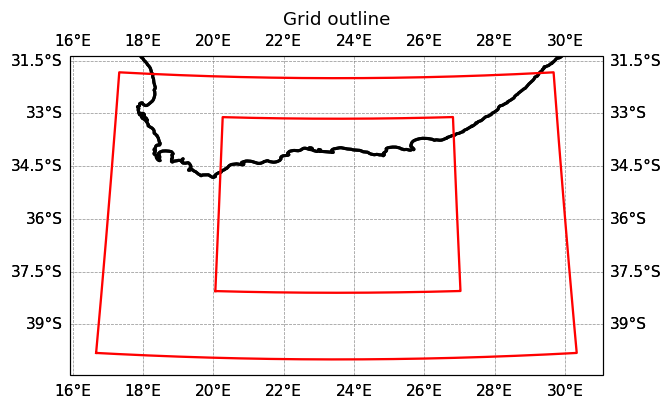
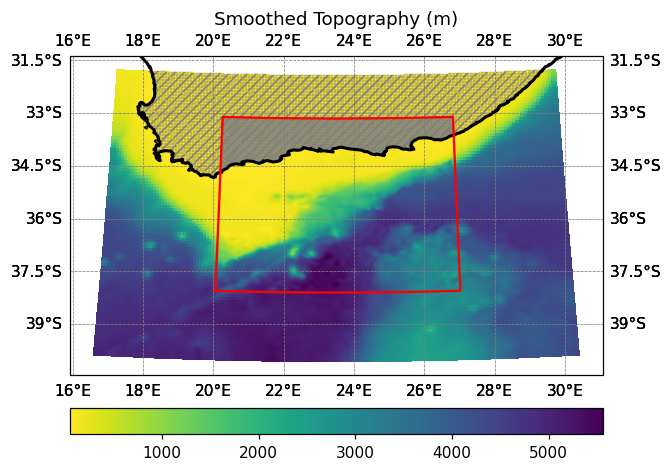

Follow **Phase 8**. Numbers and decisions specific to Agulhas below.

## B1 — check the child box against the parent's mask

Target: **20–27°E, 38–33°S** — the Agulhas Bank and the current's path along the shelf
edge.

```bash
cd ~/seaforward
python3 -c "
import xarray as xr, numpy as np
g = xr.open_dataset('forecast/scratch/Agulhas_12/CROCO_FILES/croco_grd.nc')
lon = g.lon_rho.values[0,:]; lat = g.lat_rho.values[:,0]
m = g.mask_rho.values; h = g.h.values

lo0,lo1,la0,la1 = 20.0, 27.0, -38.0, -33.0
imin=int(np.argmin(abs(lon-lo0))); imax=int(np.argmin(abs(lon-lo1)))
jmin=int(np.argmin(abs(lat-la0))); jmax=int(np.argmin(abs(lat-la1)))
sm=m[jmin:jmax+1, imin:imax+1]; sh=h[jmin:jmax+1, imin:imax+1]
print('imin=%d imax=%d jmin=%d jmax=%d' % (imin,imax,jmin,jmax))
print('child at 3x: %d x %d x 50' % ((imax-imin)*3+1,(jmax-jmin)*3+1))
print('margin: W=%d E=%d S=%d N=%d parent cells' % (imin,m.shape[1]-1-imax,jmin,m.shape[0]-1-jmax))
print('ocean %.1f%%   depth %.0f-%.0f m' % (sm.sum()/sm.size*100, sh.min(), sh.max()))
strip=lambda r: ''.join('O' if v==1 else '.' for v in r)
for e,v in [('S',sm[0,:]),('N',sm[-1,:]),('W',sm[:,0]),('E',sm[:,-1])]:
    tag='all water' if v.all() else ('ALL LAND' if v.sum()==0 else 'MIXED(%d land)'%int((v==0).sum()))
    print('  %s: %3d/%3d %-16s %s' % (e,int(v.sum()),len(v),tag,strip(v)))
"
```

```
imin=39 imax=119 jmin=23 jmax=83
child at 3x: 241 x 181 x 50
margin: W=39 E=39 S=23 N=15 parent cells
ocean 80.9%   depth 50-5556 m
  S:  81/ 81 all water
  N:   0/ 81 ALL LAND
  W:  42/ 61 MIXED(19 land)
  E:  54/ 61 MIXED(7 land)
```

**This is somisana's coastal pattern**, and it's viable:

```
                 Agulhas child        somisana child 1 (same coast)
  S (offshore)   all water   -> open  635/635 all water  -> open
  N (coast)      ALL LAND    -> close 0/635 ALL LAND     -> close
  W (cross-shore) MIXED(19)  -> open  MIXED(25)          -> open
  E (cross-shore) MIXED(7)   -> open  MIXED(25)          -> open
```

Offshore edge open, landward edge closed on genuine coast, cross-shore edges
necessarily mixed — they run from deep water up onto the beach. There is no other way
to build a coastal nest, and somisana runs three of them operationally.

## B2 — the zoom config

```bash
nano ~/seaforward/code/croco_pytools/prepro/agulhas_zoom_agrif.ini
```

```ini
[Croco_Files]
croco_files_dir = /home/you/seaforward/forecast/scratch/Agulhas_AGRIF/CROCO_FILES
croco_grd_prefix = croco_grd

[Zoom_Options]
is_zoom = True
is_agrif = True
agrif_level = 1
parent_grid = /home/you/seaforward/forecast/scratch/Agulhas_AGRIF/CROCO_FILES/croco_grd.nc

[Grid_Zoom_Params]
north_obc = False
south_obc = True
west_obc = True
east_obc = True
merging_area = 5

[Grid_Zoom_Agrif]
coef = 3
imin = 39
imax = 119
jmin = 23
jmax = 83

[Grid_Smoothing_Params]
hmin = 50.0
hmax = 6000.0
interp_rad = 2
rfact = 0.15
smooth_meth = lsmooth

[Grid_Isolated_Waterbodies]
mask_isolated_waterbodies = False
main_water_body_x_idx = 20
main_water_body_y_idx = 20

[Grid_Input_Files]
topo_file_reader = etopo2
topo_file = /home/you/seaforward/data/DATASETS_CROCOTOOLS/Topo/etopo2.nc
shp_file = /home/you/seaforward/data/DATASETS_CROCOTOOLS/gshhs/GSHHS_shp/i/GSHHS_i_L1.shp
```

Two deliberate departures from the parent:

- **`north_obc = False`** — the north edge is 0/81 ocean. Genuine coast, correctly
  closed. (Note the parent's north is *open*; the child's is *closed*. They're
  different latitudes.)
- **`rfact = 0.15`**, not the parent's 0.2 — the parent already reports `rx1 = 14.84`,
  and refining the shelf break 3× will make the layers thinner over the same slope.
  This is the one place we don't copy the parent.

Setup and build:

```bash
mkdir -p ~/seaforward/forecast/scratch/Agulhas_AGRIF/CROCO_FILES
cp ~/seaforward/forecast/scratch/Agulhas_12/CROCO_FILES/croco_grd.nc \
   ~/seaforward/forecast/scratch/Agulhas_AGRIF/CROCO_FILES/croco_grd.nc

cd ~/seaforward/code/croco_pytools/prepro
cat > build_agulhas_agrif.py << 'EOF'
import matplotlib
matplotlib.use("Agg")
import matplotlib.pyplot as plt
from Modules.croco_class import CROCO

croco = CROCO("agulhas_zoom_agrif.ini")
print("=== create_grid()")
croco.create_grid()
croco.plot_grid_outline_zoom()
plt.savefig("/tmp/ag_outline.png", dpi=110, bbox_inches="tight"); plt.close("all")
print("=== create_mask_and_topo()")
croco.create_mask_and_topo()
croco.plot_h_zoom()
plt.savefig("/tmp/ag_bathy.png", dpi=110, bbox_inches="tight"); plt.close("all")
print("=== save_grid_nc()")
croco.save_grid_nc()
print("DONE")
EOF

conda activate seaforward
python build_agulhas_agrif.py 2>&1 | tail -20
```



*`plot_grid_outline_zoom()` — the child (inner box) inside the Agulhas parent. Note the parent's edges **bow**: `make_grid_config.py` produces a curvilinear grid, so a straight index box looks slightly rotated against it.*



*`plot_h_zoom()` — the child sits on the **Agulhas Bank** (the yellow shelf, 20–27°E). Its southern half crosses the shelf break: yellow → green → dark blue, ~100 m to 4000 m, running diagonally through the box. That diagonal is both the reason to nest here and the reason `rx1` is a worry.*

## B3 — check where the box actually landed

```bash
cd ~/seaforward/forecast/scratch/Agulhas_AGRIF/CROCO_FILES
echo "requested:  39  119  23  83"
cat AGRIF_FixedGrids.in
```

```
requested:  39  119   23   83
written:    39  121   24   84        <- imax +2, jmin +1, jmax +1
```

**The displacement loop barely moved it.** Compare IGOG's coastal child, where `jmax`
marched 124 → 133 and landed on the continent.

Why the difference: the loop hunts for edges with no coastline crossing them. The
**Agulhas coast runs east–west, parallel to the north edge** — and that edge is closed
on solid land, so there was nothing to hunt. IGOG's problem was a *diagonal* coast
crossing an edge the tool was trying to open.

```bash
python3 -c "
import xarray as xr, numpy as np
g = xr.open_dataset('croco_grd.nc.1'); m = g.mask_rho.values
print('child: %d x %d   ocean %.1f%%' % (m.shape[1], m.shape[0], float(m.mean())*100))
print('box: %.2f-%.2fE  %.2f-%.2fN' % (float(g.lon_rho.min()),float(g.lon_rho.max()),
                                        float(g.lat_rho.min()),float(g.lat_rho.max())))
print('depth %.0f-%.0f m' % (float(g.h.min()), float(g.h.max())))
dx = 1/g.pm.values
print('dx: %.2f - %.2f km' % (dx.min()/1000, dx.max()/1000))
for e,v in [('S',m[0,:]),('N',m[-1,:]),('W',m[:,0]),('E',m[:,-1])]:
    tag='all water' if v.all() else ('ALL LAND' if v.sum()==0 else 'MIXED(%d land)'%int((v==0).sum()))
    print('  %s: %3d/%3d  %s' % (e,int(v.sum()),len(v),tag))
"
```

```
child: 248 x 182   ocean 80.4%
box: 20.04-27.04E  -38.12--33.09N
depth 48-5556 m
  S: 248/248  all water
  N:   0/248  ALL LAND
  W: 124/182  MIXED(58 land)
  E: 163/182  MIXED(19 land)
```

The W edge picked up 58 land cells (was 19) because the box widened 2 cells into the
Cape coast. Acceptable — somisana's child 3 has a **half-land** east edge and runs
operationally.

```
child: 248 x 182 x 50 at 1/36 deg  (~2.5 km at 35 S)
```

Note **2.5 km, not 3.06 km** like the São Tomé child. Same 1/36° grid — a degree of
longitude is shorter at 35°S than at the equator. Always read `pm`/`pn`.

## B4 — the child's initial condition

Use **SEA-FORWARD's own `make_ini`**, not croco_pytools' (Phase 8 Step 3b explains why:
it writes `9.969e+36` fill values into deep layers of small domains).

```bash
CGEN=~/seaforward/forecast/scratch/Agulhas_AGRIF/child_gen/CROCO_FILES
mkdir -p "$CGEN"
cp ~/seaforward/forecast/scratch/Agulhas_AGRIF/CROCO_FILES/croco_grd.nc.1 "$CGEN/croco_grd.nc"
cp ~/seaforward/forecast/configs/Agulhas_12/crocotools_param.py           "$CGEN/"

nano "$CGEN/crocotools_param.py"
#   Ctrl+W obc_dict ->
#   obc_dict = dict(south=1, west=1, east=1, north=0)   # child: N closed (coast)

MERC=~/seaforward/forecast/scratch/Agulhas_12/downloaded_data/MERCATOR/MERCATOR_20260717_00.nc
cd ~/seaforward/sftools
conda activate seaforward
python seaforward.py make_ini \
    --input_file "${MERC}" --output_dir "${CGEN}" \
    --run_date "2026-07-17 00:00:00" --hdays 2 --Yorig 2000
```

The child grid renamed to `croco_grd.nc` is the whole trick — `make_ini` reads whatever
grid it finds in `--output_dir` and neither knows nor cares that it's a child.

**Verify:**

```
temp  min=          0  max=      23.44  nan=0
salt  min=          0  max=       35.6  nan=0
u     min=     -1.831  max=       1.21  nan=0
v     min=     -1.243  max=     0.9914  nan=0
zeta  min=    -0.2739  max=     0.9772  nan=0
time = 9692.0 days
```

No fill values, no NaNs. And **u reaching −1.83 m/s** is the Agulhas Current showing up
in the initial condition — IGOG's child was ±0.6. The interpolation captured the
current rather than smearing it.

**Clocks:**

```bash
python3 -c "
import xarray as xr
for f, lbl in [('.../Agulhas_12/CROCO_FILES/croco_ini_MERCATOR_20260717_00.nc','parent'),
               ('.../Agulhas_AGRIF/child_gen/CROCO_FILES/croco_ini_MERCATOR_20260717_00.nc','child ')]:
    d = xr.open_dataset(f, decode_times=False)
    print(lbl, float(d.scrum_time.values.ravel()[0])/86400, 'days')
"
# parent 9692.0 days
# child  9692.0 days
```

Both at **9692.0** (= 2026-07-15, the cycle date minus `--hdays 2`). Matched by
construction — same tool, same file, same arguments. This is the failure that cost four
cycles on IGOG.

## B5 — `croco.in.1`

```bash
cd ~/seaforward/forecast/scratch/Agulhas_AGRIF
cp ~/seaforward/forecast/scratch/Agulhas_12/{cppdefs.h,param.h,croco.in,jobcomp} .
cp croco.in croco.in.1
nano croco.in.1
```

Six edits (Phase 8 Step 5). The one that matters:

```
time_stepping: NTIMES   dt[sec]  NDTFAST  NINFO
                 288     100       60      1
                         ^^^ = 300/3.  NTIMES stays 288 -- AGRIF multiplies it.
```

**Check every filename at once**, because a missed `.1` means the child writes into the
parent's output:

```bash
grep -n "CROCO_FILES/" croco.in.1
```

```
23:    CROCO_FILES/croco_grd.nc.1     <- required
34:    CROCO_FILES/croco_ini.nc.1     <- required
37:    CROCO_FILES/croco_rst.nc.1     <- required
41:    CROCO_FILES/croco_his.nc.1     <- required
44:    CROCO_FILES/croco_avg.nc.1     <- required
25:    CROCO_FILES/croco_frc.nc       ) inert: their CPP switches are off,
27:    CROCO_FILES/croco_blk.nc       ) CROCO prints "Unrecognized keyword
29:    CROCO_FILES/croco_clm.nc       ) ... DISREGARDED" and moves on
92+:   croco_dia*, floats, stations   )
```

plus `boundary:` → `XXXXXXXXX`.

!!! note
    Getting `his`/`avg` wrong is the easy mistake: both grids write to the same file, you lose both, and it looks like a physics problem.

Verify the driver's sed targets exist:

```bash
grep -cE "^start_date:|^end_date:|^time_stepping:|^restart:|^history:|^averages:|^initial:|^boundary:|^online:" croco.in.1
# 9
```

## B6 — two binaries

One-way vs two-way is a **compile-time** flag, so build both once and let the driver
choose.

```bash
cd ~/seaforward/forecast/scratch/Agulhas_AGRIF
nano cppdefs.h
#   Ctrl+W AGRIF -> FIRST match (~line 80, your REGIONAL block --
#   NOT the one near 1066, which is the VORTEX test case)
#     # define AGRIF
#     # undef  AGRIF_2WAY

conda deactivate
source ~/seaforward/env.sh
which nf-config                 # MUST be .../opt_seq/bin/nf-config
./jobcomp 2>&1 | tail -3        # CROCO is OK
mv croco croco_1way

nano cppdefs.h
#   Ctrl+W AGRIF_2WAY -> line 81 only:  # define AGRIF_2WAY
#   line 80 stays "# define AGRIF"

./jobcomp 2>&1 | tail -3
mv croco croco_2way
ls -lh croco_1way croco_2way    # 1.7M each
```

**`AGRIF` stays defined in both.** It means "there is a child at all". Only
`AGRIF_2WAY` toggles.

## B7 — the last build-phase pieces

```bash
cd ~/seaforward/forecast/scratch/Agulhas_AGRIF
cp ~/seaforward/forecast/configs/Agulhas_12/crocotools_param.py CROCO_FILES/
cp child_gen/CROCO_FILES/crocotools_param.py CROCO_FILES/crocotools_param_child.py
cp CROCO_FILES/AGRIF_FixedGrids.in .          # RUN dir, not CROCO_FILES

grep -H obc_dict CROCO_FILES/crocotools_param.py CROCO_FILES/crocotools_param_child.py
```

```
crocotools_param.py:       obc_dict = dict(south=1, west=1, east=1, north=1)
crocotools_param_child.py: obc_dict = dict(south=1, west=1, east=1, north=0)
```

Parent north **open**, child north **closed** — different latitudes, different masks.